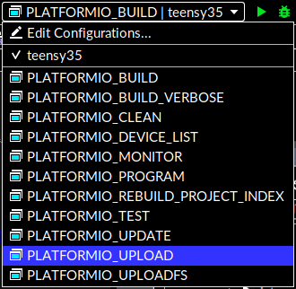

# But
Ce projet permet de manipuler rapidement des moteurs Dynamixel XL430 avec un Teensy 3.5, destiné aux 1As du Club INTech.

# Comment l'utiliser?
* Ouvrez un terminal, allez dans le dossier dans lequel vous voulez mettre le projet. Clonez le projet avec la commande suivante: `git clone https://github.com/Club-INTech/TechTheTide-Nocturne1` 
> Si Git vous demande des identifiants, c'est très probable que vous vous êtes plantés dans l'URL, vérifiez-la
* Lancez le script `setup.sh` dans le dossier que vous venez de télécharger. `cd TechTheTide-Nocturne1` et `./setup.sh`
> Si votre Linux se plaint que le fichier n'est pas exécutable, rendez le exécutable: `chmod u+x setup.sh`

* Ouvrez le projet dans CLion (Open):

* Sélectionnez le dossier du projet et cliquez sur OK:

# Coder
Le code exécuté par la Teensy est celui dans la fonction `int main()` dans le fichier `src/main.cpp` 

# Lancer la vérification ou envoyer le code
Pour utiliser une des actions présentées en dessous, il faut la sélectionner (en haut à droite de CLion) puis cliquer sur "Build" (le petit marteau):

# Vérification que ça compile

# Envoyer sur la Teensy 3.5

